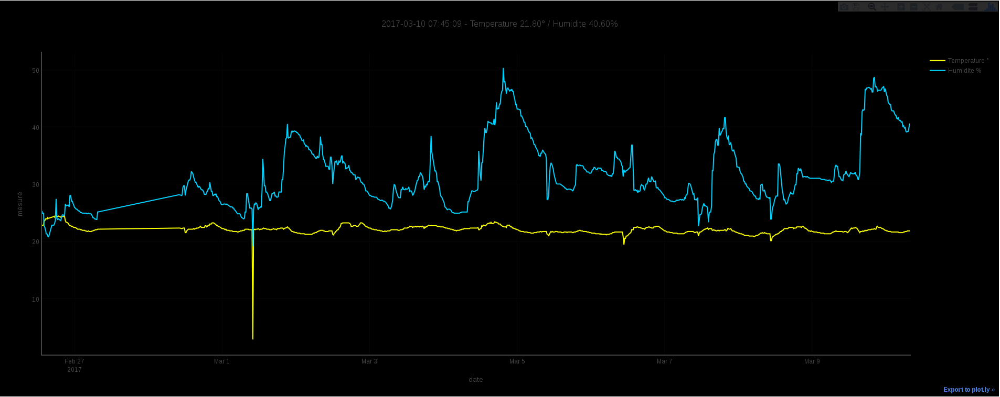

homeForecast
=

Polling DHT22 with Raspberry Pi
Data graphed with Plotly, we are using plotly.offline so there is no connection with plot.ly

Data are stored in homeData.csv :

```bash
datetime,temperature,humidity
2017-02-26 13:24:00,22.80,25.30
```
html file directly stored in /var/www/html

Result :



Requirements
==

- Adafruit libraries

```bash
pip install --upgrade pip
apt-get install apt-transport-https python-dev -y
pip install Adafruit_Python_DHT
```

- Plotly

```bash
pip install plotly
```

- crontab
Polling every 15 minutes

```bash
*/15 *  * * * python /home/pi/Documents/homeForecast/homeForecast.py
```
